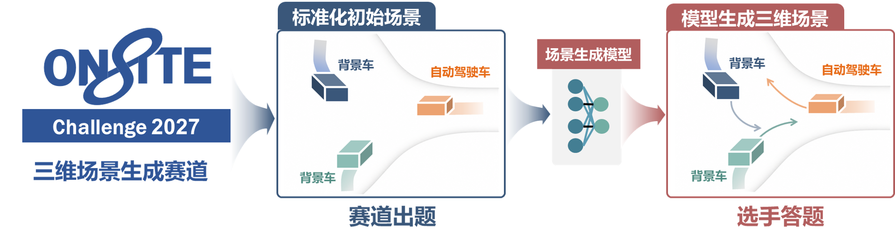

<!-- 将横向 OnSite 标志上传至 public/ONSITE-blue-logo-cn_name.svg。 -->
<p align="center">
  <a href="https://onsite.com.cn/">
    
  </a>
</p>

<h1 align="center">OnSite 3D Scenario Generation Benchmark</h1>

<p align="center">
  <strong>面向自动驾驶测试的三维场景生成基准</strong>
</p>

<p align="center">
  AI 服务 AI：从历史观测生成未来驾驶场景，以分层评测检验场景的测试价值。
</p>

<p align="center">
  <a href="https://onsite.com.cn/">
    
  </a>
  &nbsp;&nbsp;
  <a href="https://nova-chen151.github.io/Onsite3DSG-Benchmark.github.io/">
    
  </a>
  &nbsp;&nbsp;
  <a href="https://nova-chen151.github.io/Onsite3DSG-Benchmark.github.io/#leaderboard">
    
  </a>
  &nbsp;&nbsp;
  <a href="https://github.com/Nova-chen151/Onsite3DSG-Benchmark.github.io">
    
  </a>
</p>

<p align="center">
  <a href="https://nova-chen151.github.io/Onsite3DSG-Benchmark.github.io/#leaderboard"><strong>🏆 点击进入排行榜 / View Leaderboard →</strong></a>
</p>

<p align="center">
  <a href="#overview">项目介绍</a> ·
  <a href="#task">任务设置</a> ·
  <a href="#evaluation">评测体系</a> ·
  <a href="#getting-started">使用与发布</a>
</p>

<p align="center">
  <a href="public/overview.png">
    
  </a>
</p>

## Overview

**生成的驾驶场景，不仅要看起来真实，还要能够用于可信、有效的自动驾驶测试。**

OnSite 3DSG Benchmark 面向可控、可扩展的自动驾驶场景生成与测试。基准从统一的历史驾驶上下文出发，考察模型生成未来场景的能力，并进一步分析这些场景能否为自动驾驶算法提供有价值的测试条件。

围绕这一目标，评测从**观测质量**逐步深入到**场景保真度、策略响应与质量感知测试有效性**：既关注画面是否可信、交通演化是否合理，也关注自动驾驶策略在生成场景中的表现，以及失效是否具有可信的场景依据。

> **仓库定位**：本仓库维护项目介绍、任务说明与排行榜展示网站，不是生成模型或评测引擎的完整实现。当前榜单使用演示数据，尚未连接正式提交与评测后台。

## Task

### 从历史观测到未来驾驶场景

参赛方法根据统一赛题提供的历史信息生成未来场景，再通过质量评测和驾驶策略测试分析生成结果。

| 环节 | 内容 |
| --- | --- |
| 历史输入 | 当前页面介绍的输入包括连续 10 帧历史图像、相机参数、主车状态及相关场景条件。 |
| 未来生成 | 按统一接口输出未来驾驶场景，保持多视角观测及相关场景信息在时间与空间上的对应关系。 |
| 一致性检查 | 检查历史与未来的边界连续性、缺失帧、异常值、运动合理性及地图一致性。 |
| 配对测试 | 将同一组驾驶策略接入真实场景与生成场景，对比其安全性、舒适性、路线进度与决策变化。 |

```text
历史驾驶上下文 → 未来场景生成 → 分层质量评测 → 驾驶策略配对测试 → 测试有效性分析
```

## Evaluation

### 从视觉真实感走向测试有效性

下表对应当前网站展示的四层评测体系。各层指标回答不同的问题，不能仅用单一视觉指标或一次策略失效替代完整评测。

| 评测层级 | 核心问题 | 当前页面展示的指标 |
| --- | --- | --- |
| **Observation Quality**<br>观测质量 | 生成观测是否具有可信的视觉质量与时间连续性？ | FVD ↓、CLIP-IQA+ ↑、DINO-T ↑ |
| **Scenario Fidelity**<br>场景保真度 | 跨视角几何、图像与交通状态，以及交通演化是否一致、合理？ | Epi@3 ↑、TVC ↑、TRS ↑ |
| **Policy Response**<br>策略响应 | 自动驾驶策略在生成场景中的安全性、舒适性与路线进度如何？ | RPDMS ↑、Route Completion ↑ |
| **Quality-Aware Testing Effectiveness**<br>质量感知测试有效性 | 在考虑场景质量的前提下，生成场景能否可靠地暴露策略失效？ | QTES ↑ |

**策略表现与场景的测试价值需要区分。** 生成场景导致策略失败，并不自动意味着它是有效的测试样例。评测还需要考虑失败是否与低质量画面、几何不一致或不合理的交通演化有关，避免将生成缺陷误判为有价值的测试难例。

上述指标名称、分组与方向对应当前网站的[在线评测说明](https://nova-chen151.github.io/Onsite3DSG-Benchmark.github.io/#evaluation)；正式指标定义、计算配置、有效性条件及排名规则以发布的评测协议为准。

## Project Status

本仓库当前用于项目内容与排行榜交互展示。正式上线需要接入经审核的赛事成绩、身份验证、提交评测与证书签发流程；参赛安排和正式成绩以赛事公告为准。

页面中的品牌标志与媒体素材保留原文件。字体相关许可信息见 [public/FONT-LICENSES.txt](public/FONT-LICENSES.txt)。
